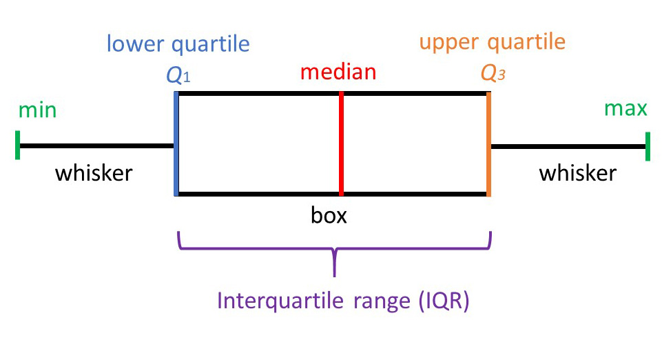

Run by: `r Sys.getenv("USER")` 

CRISPR screen report for project `r proj.name.pref`, analysis based on `r data.type`.

organism for annotations: `r organism`

report version v 0.4


<!-- 
draft of pipeline report
to be used with pipeline_report.v0.4.R

17i2022 - 22iii2022 - 4v2022

 -->


----------------

```{r, echo=FALSE}
htmltools::img(src = knitr::image_uri(file.path("logos", "SLLNew.png")), 
               alt = 'SLLlogo', 
               style = 'position:absolute; top:0; right:0; padding:10px; width: 20vw')
```


```{r include=FALSE,cache=FALSE}
library(knitr)
library(bookdown)


knitr::opts_chunk$set(echo = FALSE, 
                      collapse = TRUE, 
                      warning = FALSE, 
                      message = FALSE)


script_pth="./pipeline_report.v0.4.R"
knitr::read_chunk(script_pth)

source("./crispr_pipeline_report_functions.R")
```


```{r dirs, include=FALSE,cache=FALSE}

```


```{r prep_environment, include=FALSE,cache=FALSE}

```


*Schematics with explanation of some plots can be found in the Appendix.*


```{asis, echo=is.RSL}
***This report presents analysis based on RSL counts.***
```

```{asis, echo=!is.RSL}
***This report presents analysis based on read counts.***
```


# Contents

1. [Project Description](#Project-Description)
2. [Practical Information](#Practical-Information)
3. [Materials and Methods](#Materials-and-Methods)
4. [Results](#Results)

	4.1 [Library Summary Statistics](#sumstat)

	4.2 [Statistical Analysis](#mageck)
	
	4.3 [Replicate Concordance](#RepCon)

5. [Comments](#Comments)
6. [Deliverables](#Deliverables)
7. [References](#References)
8. [Appendix](#Appendix)

<br />
<br />

# Project Description <a name="Project-Description"></a>

Here we write about the project.

<br />
<br />

# Practical Information <a name="Practical-Information"></a>


## Important practical information

### Data responsibility

Unfortunately, we do not have resources to keep any files associated with this project.
We recommend that you back up the results delivered by us.

### Acknowledgments

If you use results obtained with help of the **CRISPR Functional Genomics Facility** in a publication, we kindly ask you to acknowledge and cite us [@crisprRSL].

<br />
<br />


# Materials and Methods <a name="Materials-and-Methods"></a>

## Library Preparation


## Data Processing

* Quality of the sequencing run was assesed using `FastQC` [@fastqc].


```{asis, echo=is.RSL}
* Reads were assigend to sgRNA - RSL combinations using `CrisprCounter.jar` [@CrisprCounter].
```

```{asis, echo=!is.RSL}
* Reads were assigned to sgRNAs using `MAGeCK count` [@mageck].
```

```{asis, echo=is.RSL}
* For analysis of RSL counts, sgRNA - RSL combinations were subject to filtering step based on their detection in input library. The basis of this step is the fact that not all theorethical combinations were present in the input library, thus removal of the combinations not detected or detected less than expected number of times served to remove technical artefacts.
sgRNA - RSL combinations which were detected in only one of the technical replicates and together less than 4 times in two technical replicates were removed from the data. The remaining detected sgRNA - RSL combinations were summarised per sgRNA.
```

* Statistical analyses, plotting and report generation were perfomed in `R` [@R-base].


* Analysis of screen results was performed uing Robust Rank Aggregation test (rra) from `MAGeCK` [@mageck].

* Functional annotation of ranked gene lists was performed by GSEA Enrichment test [@gsea] implemented in `clusterprofiler` [@clusterprofiler]. The ranking metric used in this analysis was log2 fold change. The annotation term databases were **Gene Ontology** [@GO] and **reactome** [@reactome]. Plots visualising the enriched categories were made using `enrichplot` [@enrichplot].

* Replicate consistency on the counts level (PCA, Spearman clustering) was assesed on `r if(is.RSL){"RSL"}else{"read"}` counts normalised by the trimmed mean of M-values (TMM) method [@TMM].


<br />
<br />


# Results <a name="Results"></a>


## Library Summary Statistics <a name="sumstat"></a>


Plots for library statistics and summary of quantification of sgRNA levels. These are diagnostic plots which help to determine the overall quality of the screen. 

Please note these statistics are output at the read summarisation step `r if(is.RSL){"and are different than the totals in the RSL analysis which employs an additional filtering step"}`.


Number of reads assigned to sgRNAs in all libraries is presented on Figure \@ref(fig:count-stats-plot).


```{r data_countingstats_rsl, include=FALSE,cache=FALSE}

```

```{r data_countingstats_reads, include=FALSE,cache=FALSE}

```


```{r count-stats-plot, echo=FALSE, fig.show='show', cache=FALSE, fig.cap="Number of reads assigned to sgRNAs. Numbers inside bars indicate the fraction of reads assigned to sgRNAs."}

```

```{r count-stats-plot-save, include=FALSE,cache=FALSE}

```
This plot is saved as **`r fname`**.


<br />

Table \@ref(tab:data-countingstats-table) presents summary statistics of sgRNA quantification.


```{r data-countingstats-table, echo=FALSE ,results='asis'}

```


```{r data_countingstats-save, include=FALSE,cache=FALSE}

```
This table is saved as **`r fname`**.


<br />

<br />


`r if(is.RSL){"RSL"}else{"Reads"}`
per guide diagnostic plot is presented on Figure \@ref(fig:reads-per-guide-boxplot).


```{r reads-per-guide, include=FALSE,cache=FALSE}

```

The box plot presents distribution of read counts per guide for all guides.

The violin and box plot combination with removed outliers is to demonstrate the distributionon the majority of data. Outliers here are the standard Min(Min, Q1 - 1.5 IQR) / Max(Max,Q3 + 1.5 IQR).


```{r reads-per-guide-boxplot, echo=FALSE, fig.show='show', fig.width=10, cache=FALSE, fig.cap="Number of reads per sgRNA."}

```


```{r reads-per-guide-violinplot, echo=FALSE, fig.show='show',fig.width=10,cache=FALSE, fig.cap="Number of reads per sgRNA after outliers removal."}

```

```{r boxplots-save, include=FALSE,cache=FALSE}

```

These plots are saved as **`r fname`**.


<br />


```{asis, echo=is.RSL}
*Some RSL specific text*
```


```{r histogram-rslguide, eval=is.RSL}

```


```{r histogram-rslguide-plot1, eval=is.RSL, dev='png', fig.show='show',fig.dim=c(10, 5), cache=FALSE, fig.cap="Reads per RSL-guide after input-based filtering for RSL analysis. Full scale."}

```

```{r histogram-rslguide-plot2, eval=is.RSL, dev='png', fig.show='show',fig.dim=c(10, 5), cache=FALSE, fig.cap="Reads per RSL-guide after input-based filtering for RSL analysis. Reduced X abd Y scale to visualise region of largest data density."}

```


```{r detected-guides-table, eval=is.RSL,results='asis'}

```


<br />


<br />
<br />

## Statistical Analysis of sgRNA Abundance <a name="mageck"></a>


MAGeCK is a tool designed to identify positively and negatively selected sgRNAs and genes in genome scale CRISPR/Cas9 knockout experiments. It encompasses four steps: read count normalization, mean-variance modeling, sgRNA ranking and gene ranking (ref).

sgRNAs are ranked based on P-values calculated from the negative binomial model, and a modified robust ranking aggregation (α-RRA) algorithm is used to identify positively or negatively selected genes. More specifically, α-RRA assumes that if a gene has no effect on selection, then sgRNAs targeting this gene should be uniformly distributed across the ranked list of all the sgRNAs. α-RRA ranks genes by comparing the skew in rankings to the uniform null model, and prioritizes genes whose sgRNA rankings are consistently higher than expected. α-RRA calculates the statistical significance of the skew by permutation.

The results are the sgRNA summary (`sgrna_summary.txt`) and gene summary files (`gene_summary.txt`) for each of the comparisons. These files contain the summaries of the the statistical significance of positive selections and negative selections at sgRNA level and gene level. The file formats are described in more detail in section [Deliverables](#deliv). 


<br />
<br />
<br />


<br />
<br />
<br />


The comparisons analysed in this section are summarised in Table \@ref(tab:contrasts-table).

```{r read-contrasts, include=FALSE,cache=FALSE}
```

```{r contrasts-table, echo=FALSE ,results='asis'}

```


```{r collect-rra-res, include=FALSE,cache=FALSE}
```

```{r echo=FALSE, results='asis'}
options(knitr.duplicate.label = "allow")
res <- vector(mode = "list", length = n.cont)

for (i in my.contrasts) {
    res[[i]] <- knitr::knit_child("crispr_report_rra.Rmd", quiet = TRUE, envir = environment())
}

cat(unlist(res), sep = '\n')
```

<br />
<br />
<br />


## Replicate Concordance <a name="RepCon"></a> {.tabset}


Replicate concordance can be adressed using several methods probing different properties of data.


### PCA <a name="PCA"></a>


Principal Component Analysis (PCA) is a technique to summarize and to visualize the information in a data set containing observations described by multiple inter-correlated quantitative variable. PCA is used to extract the important information from a multivariate data table and to express this information as a set of few new variables called principal components. These new variables correspond to a linear combination of the originals. The information in a given data set corresponds to the total variation it contains. The goal of PCA is to identify directions (or principal components) along which the variation in the data is maximal.
In other words, PCA reduces the dimensionality of a multivariate data to two or three principal components, that can be visualized graphically, with minimal loss of information.

PCA of TMM-normalised log2 read counts summarised to individual
sgRNA (A) and gene (B) aims to assess similarities amongst the samples in the dataset. In some cases the counts
summarised by sgRNA may yield unstable results due to uneven effect on individual guides targeting the same gene. To
overcome this, PCA was computed for counts summarised per gene (as sum of sgRNA counts).


```{r pca_prep, echo=FALSE, include=FALSE}

```


```{r pca-plot, dev='png', echo=FALSE, fig.show='show',fig.dim=c(12, 6), cache=FALSE, fig.cap="PCA on read counts summarised per sgRNA (A) and gene (B)."}

```

### Sample Correlation (Spearman) <a name="Corr"></a>


Another method for assesing the similarity between samples and to identify outliers is by comparing
pairwise sample correlations. Rank based Spearman correlation coefficients between all samples are plotted as heatmap.


```{r smpl_correlations, echo=FALSE, include=FALSE}

```


```{r smpl-correlations-gene, dev='png', echo=FALSE, fig.show='show',fig.dim=c(4, 4), cache=FALSE, fig.cap="Pairwise Spearman correlations between samples using log-normalised read counts summarised to genes."}

```


```{r smpl-correlations-sgRNA, dev='png', echo=FALSE, fig.show='show',fig.dim=c(4, 4), cache=FALSE, fig.cap="Pairwise Spearman correlations between samples using log-normalised read counts summarised to sgRNAs."}

```


<!-- 
### Scatter Plots

 -->

`r if(!is.RSL){"### Scatter Plots"}`


```{asis, echo=!is.RSL}
Log2 fold changes for each gene were plotted for each pair of comparisons (interactive plots). The comparisons presented in this section are listed in Table \@ref(tab:contrasts-table).
```


```{r contrast_scatters, eval=!is.RSL, echo=FALSE, include=FALSE}

```


<!-- 
  This works for non-interactive plots

```{r dev='png', echo=FALSE, fig.show='show',fig.width=10, cache=FALSE, fig.cap="Scatter plots depicting log2 fold changes in each pair of comparisons."}
for (i in c(1:contrasts.pairs.number)){
  print(scatters[[i]])
}
```
 -->


```{r eval=!is.RSL, echo=FALSE, results='asis'}
options(knitr.duplicate.label = "allow")
scatter_plots <- vector(mode = "list", length = n.cont)

for (i in c(1:contrasts.pairs.number)){
    scatter_plots[[i]] <- knitr::knit_child("crispr_report_int_scatter.Rmd", quiet = TRUE, envir = environment())
}

cat(unlist(scatter_plots), sep = '\n')
```


<br />
<br />
<br />


# Comments <a name="Comments"></a>

Custom text which helps to interpret the screen results.

<br />
<br />
<br />


# Deliverables <a name="Deliverables"></a> {#deliv}


## Tables

All tables included in this report are saved in files indicated throughout the text.

All tables are tab-delimited and can be open in a spreadsheet application (Excel, LibreOffice, Numbers). Please make sure to set the decimal to `.` when importing the tables to avoid content changes.

<br />
Two more complex file formats are described in detail below.

<br />
**Results of robust rank aggregation (RRA) analysis (MAGeCK) to identify enriched and depleted genes** in files `Table.N.RRA_mageck.reads.COMPARISON.tsv`. 
Each row corresponds to a targeted gene, all genes are shown.

Fields in the table:

* `id` gene id

* `description` of gene product

* `num` number of sgRNA guides targeting the gene

* `score` RRA score by MAGeCK

* `p value` uncorrected p value from the RRA test

* `FDR` false discovery rate, i.e. p value adjusted for multiple comparisons

* `rank` position on a gene list ranked by the RRA score

* `goodsgRNA` number of sgRNAs whose ranking is below the alpha cutoff (0 in this case)

* `lfc` gene log2(fold change)


Fields specific to **positive** selection are prefixed with `pos`.

Fields specific to **negative** selection are prefixed with `neg`.


<br />
**Results of GSEA** in files `Table.N.GSEA.GO.COMPARISON.SELECTION.tsv` and `Table.N.GSEA.reactome.COMPARISON.SELECTION.tsv`. This is a table with GSEA results. Each row corresponds to a tested pathway, only pathways enriched above the significance threshold are shown.


* `ONTOLOGY` not available for reactome analysis

* `ID` of category (internal to database)

* `Description` of category gene set

* `setSize`  size of the gene set after removing genes not present in the data

* `enrichmentScore` GSEA enrichment score, same as in Broad GSEA implementation

* `NES` enrichment score normalized to mean enrichment of random samples of the same size

* `pvalue`  p value from the GSEA test, as implemented in R package `fgsea`

* `p.adjust` p value adjusted for multiple comparisons (FDR)

* `qvalues` the proportion of false positives incurred 

* `leading_edge` leading-edge subset in a gene set are those genes that appear in the ranked list at or before the point at which the running sum reaches its maximum deviation from zero; the leading-edge subset can be interpreted as the core that accounts for the gene set’s enrichment signal

* `core_enrichment` genes that contribute to the leading-edge subset within the gene set; this is the subset of genes that contributes most to the enrichment result for given pathway


<br />

## Plots

All plots included in this report are saved in files indicated throughout the text.


<br />
<br />
<br />


# References <a name="References"></a>


<div id="refs"></div>

<br />
<br />
<br />


# Appendix <a name="Appendix"></a>


This section offers explanations of several types of plots present in this report.


## Boxplot and Violin Plot




Boxplot is one of the simplest ways of representing a distribution of a continuous variable. It consists of two parts:

* Box — Extends from the first to the third quartile (Q1 to Q3) with a line in the middle that represents the median. The range of values between Q1 and Q3 is also known as an Interquartile range (IQR).

* Whiskers — Lines extending from both ends of the box indicate variability outside Q1 and Q3. The minimum/maximum whisker values are calculated as Q1/Q3 -/+ 1.5 * IQR. Everything outside is represented as an outlier.


Violin plot additionally shows the probability density of the data at different values, allowing for a better visualisation of data distribution.


source: [R-bloggers](https://www.r-bloggers.com/2021/11/how-to-make-stunning-boxplots-in-r-a-complete-guide-with-ggplot2/)

[image source](https://www.simplypsychology.org/boxplots.html)

<br />
<br />


## GSEA plot


The primary result of the gene set enrichment analysis is the enrichment score (ES), which reflects the degree to which a gene set is overrepresented at the top or bottom of a ranked list of genes. GSEA calculates the ES by walking down the ranked list of genes, increasing a running-sum statistic when a gene is in the gene set and decreasing it when it is not. The magnitude of the increment depends on the correlation of the gene with the phenotype. The ES is the maximum deviation from zero encountered in walking the list. A positive ES indicates gene set enrichment at the top of the ranked list; a negative ES indicates gene set enrichment at the bottom of the ranked list.

In the analysis results, the enrichment plot provides a graphical view of the enrichment score for a gene set:


* The top portion of the plot shows the running ES for the gene set as the analysis walks down the ranked list. The score at the peak of the plot (the score furthest from 0.0) is the ES for the gene set. Gene sets with a distinct peak at the beginning (such as the one shown here) or end of the ranked list are generally the most interesting.

* The middle portion of the plot shows where the members of the gene set appear in the ranked list of genes. **The leading edge subset** of a gene set is the subset of members that contribute most to the ES. For a positive ES (such as the one shown here), the leading edge subset is the set of members that appear in the ranked list prior to the peak score. For a negative ES, it is the set of members that appear subsequent to the peak score.

* The bottom portion of the plot shows the value of the ranking metric as you move down the list of ranked genes. The ranking metric measures a gene’s correlation with a phenotype. The value of the ranking metric goes from positive to negative as you move down the ranked list. A positive value indicates correlation with the first phenotype and a negative value indicates correlation with the second phenotype. For continuous phenotypes (time series or gene of interest), a positive value indicates correlation with the phenotype profile and a negative value indicates no correlation or inverse correlation with the profile.

The ranking metric used in this analysis is -log10 of positive / negative RRA score.

For more deatils please refer to the source of this text [GSEA User Guide](https://www.gsea-msigdb.org/gsea/doc/GSEAUserGuideFrame.html).


<!-- ------------

https://github.com/crazyhottommy/RNA-seq-analysis/blob/master/GSEA_explained.md


Terms used in this analysis

https://www.biobam.com/gene-set-enrichment-analysis/?cn-reloaded=1

    The Enrichment Score (ES) reflects the degree of over-representation of a GO at the extremes of the ranked list.

    The normalized ES is the primary statistic for this type of enrichment results.

    The FDR is the adjusted p-value, a statistical value adjusted for multiple testing.

    The last column indicated if a GO is enriched at the top or the bottom of the ranked list.

The enrichment plot shows a green line representing the running ES for a given GO as the analysis goes down the ranked list. The value at the peak is the final ES. The middle part shows where the members (GOs) of the dataset appear in the ranked list. Those genes that appear at or before the ES represent the Leading Edge Subset. The lower part shows the value of the ranking metric as it moves down the list of the ranked genes.


NES 

https://www.biostars.org/p/132575/
ES normalized to the mean enrichment of random samples of the same size. The method employs random sampling of gene sets of the same size as the gene set being tested to assess significance and for normalization. The number of samplings is specified as a parameter.
 -->


# SessionInfo

```{r}
sessionInfo()
#mySIprint(sessionInfo())
```


